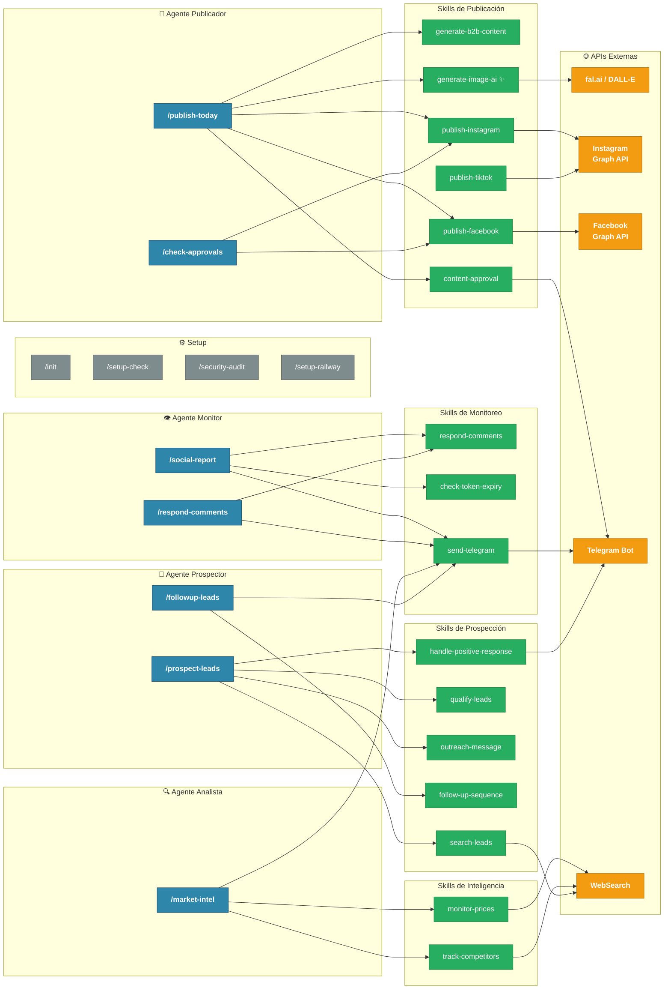
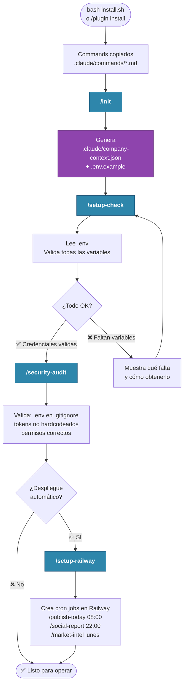
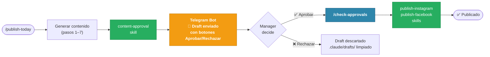
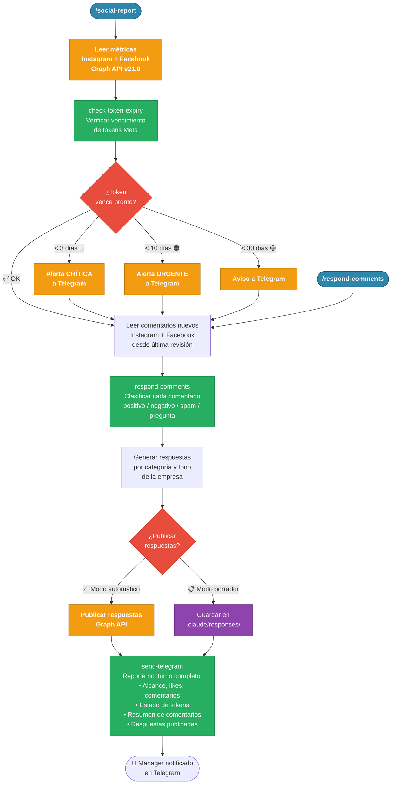
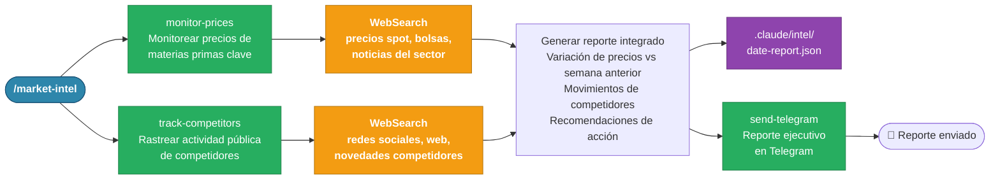
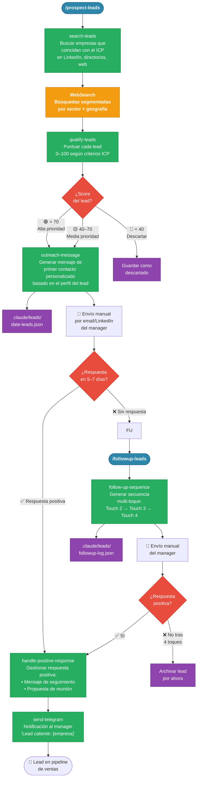
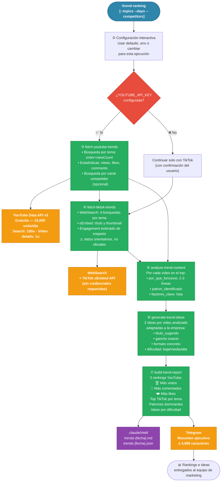

# Marketing Agents — Flujo de Ejecución

Diagramas de flujo de los 4 agentes, sus commands y los skills que ejecutan.
Se renderizan en GitHub y en VS Code (extensión: Mermaid Preview).

---

## 1. Ecosistema completo

Visión general de cómo se conectan commands → skills → APIs externas.

---

## 2. Configuración inicial (una sola vez)

Se ejecuta al instalar el plugin en un nuevo proyecto de empresa.

---

## 3. Publicación diaria — `/publish-today`

El flujo más completo del toolkit. Lo ejecuta el agente `content-publisher` cada mañana.

```mermaid
flowchart TD
    classDef cmd fill:#2E86AB,stroke:#1a5276,color:#fff,font-weight:bold
    classDef skill fill:#27AE60,stroke:#1e8449,color:#fff
    classDef file fill:#8E44AD,stroke:#6c3483,color:#fff
    classDef api fill:#F39C12,stroke:#b7770d,color:#fff,font-weight:bold
    classDef dec fill:#E74C3C,stroke:#c0392b,color:#fff

    START(["/publish-today\n[tema opcional]"]):::cmd

    START --> S1["① Cargar contexto\ncompany-context.json\nnombre, sector, tono, país"]:::file

    S1 --> S2["② Leer historial\nposts/history.json\núltimos 7 posts → no repetir tópico"]:::file

    S2 --> S3["③ Cargar parrilla\ncontent-calendar.json\n6 categorías con pesos"]:::file

    S3 --> S4["④ Detectar contexto del día\nWebSearch: fecha especial en el país"]:::api

    S4 --> DEC1{"¿Fecha especial\nhoy?"}:::dec
    DEC1 -->|"🗓️ Sí (ej. 8 marzo)"| CAT_ESP["Categoría forzada:\nFecha especial / coyuntura"]
    DEC1 -->|"❌ No"| CAT_ROT["Categoría por rotación:\nla menos usada en 7 días"]

    CAT_ESP & CAT_ROT --> S5["⑤ Selección de tópico"]

    S5 --> DEC2{"¿Fuente\ndel tópico?"}:::dec
    DEC2 -->|"CLI arg\n/publish-today 'tema'"| TOP_A["Usar argumento\ndel usuario"]
    DEC2 -->|"Calendar con\ntópicos pendientes"| TOP_B["Siguiente tópico\nde la parrilla"]
    DEC2 -->|"Sin predefinidos"| TOP_C["Generar autónomamente\nbasado en categoría\ny contexto de empresa"]

    TOP_A & TOP_B & TOP_C --> S6A

    S6A["⑥A Análisis de brand kit\n.claude/brand-images/\n→ leer con visión"]:::file

    S6A --> DEC3{"¿Imágenes\nen la carpeta?"}:::dec
    DEC3 -->|"✅ Sí"| VISION["Extraer paleta,\nestilo, mood\n→ brand-style.json"]:::file
    DEC3 -->|"❌ No"| S6B
    VISION --> S6B

    S6B["⑥B Generar imagen con IA\nskill: generate-image-ai"]:::skill

    S6B --> DEC4{"¿API key\ndisponible?"}:::dec
    DEC4 -->|"FAL_KEY"| FAL["fal.ai FLUX Schnell\n~$0.003/imagen · 3 seg\n→ URL pública persistente"]:::api
    DEC4 -->|"OPENAI_API_KEY"| DALLE["DALL-E 3\n~$0.04/imagen · 10 seg\n→ URL pública 60min"]:::api
    DEC4 -->|"Sin key"| NOGEN["Solo prompt_externo\npara Artlist / Midjourney"]

    FAL & DALLE & NOGEN --> S7

    S7["⑦ Generar contenido\nskill: generate-b2b-content\n• Instagram caption + hashtags\n• Facebook mensaje"]:::skill

    S7 --> S8["⑧ Preview completo\nImagen generada + textos\ncon formato final"]

    S8 --> DEC5{"¿Usuario\nconfirma?"}:::dec
    DEC5 -->|"✏️ Editar"| S7
    DEC5 -->|"❌ No"| DRAFT["Guardar borrador\npublished: false"]
    DEC5 -->|"✅ Sí"| S9

    S9["⑨ Publicar en Instagram\nskill: publish-instagram\nGraph API v21.0"]:::skill
    --> S10["⑩ Publicar en Facebook\nskill: publish-facebook\nGraph API v21.0"]:::skill
    --> S11["⑪ Guardar historial\nposts/history.json → 30 posts max\nposts/images/date.json → metadata imagen"]:::file
    --> DONE(["✅ Publicado\nPróxima categoría sugerida"])
```

### Variante: Con aprobación por Telegram

Para equipos donde el manager debe aprobar el contenido antes de publicar.

---

## 4. Monitoreo nocturno — `/social-report` + `/respond-comments`

El agente `social-monitor` lo ejecuta automáticamente cada noche.

---

## 5. Inteligencia de mercado — `/market-intel`

El agente `market-analyst` lo ejecuta semanalmente (lunes).

---

## 6. Prospección B2B — `/prospect-leads` + `/followup-leads`

El agente `sales-prospector`. El ciclo completo puede tomar 2–3 semanas.

---

## 7. Cadencia de ejecución

| Frecuencia | Horario | Command | Agente | Acción |
|---|---|---|---|---|
| **Diario** | 08:00 | `/publish-today` | `content-publisher` | Genera y publica contenido en Instagram y Facebook |
| **Diario** | 22:00 | `/social-report` | `social-monitor` | Revisa métricas, comentarios y tokens; notifica en Telegram |
| **Bajo demanda** | — | `/respond-comments` | `social-monitor` | Genera y publica respuestas a comentarios |
| **Bajo demanda** | — | `/check-approvals` | `content-publisher` | Publica borradores aprobados por Telegram |
| **Semanal** | Lunes 09:00 | `/market-intel` | `market-analyst` | Reporte de precios y actividad de competidores |
| **Semanal** | Miércoles 08:00 | `/trend-ranking` | `trend-analyst` | Rankings de contenido viral YouTube + TikTok con ideas para replicar |
| **Semanal** | Martes | `/prospect-leads` | `sales-prospector` | Busca y califica nuevos leads |
| **Multi-toque** | +5d, +10d, +15d | `/followup-leads` | `sales-prospector` | Seguimiento a leads sin respuesta |

---

## 8. Archivos de estado del sistema

Estos archivos persisten entre ejecuciones y actúan como la "memoria" del toolkit.

| Archivo | Se crea en | Se lee en | Propósito |
|---|---|---|---|
| `.claude/company-context.json` | `/init` | Todos los commands | Contexto de empresa: nombre, sector, tono, ICP |
| `.claude/posts/history.json` | `/publish-today` ⑪ | `/publish-today` ② | Historial de 30 posts — evita repetición de tópicos |
| `.claude/posts/{fecha}.json` | `/publish-today` ⑪ | `/check-approvals` | Post del día: caption, IDs, estado de publicación |
| `.claude/posts/images/{fecha}.json` | `/publish-today` ⑥B | — | Metadatos de imagen generada: URL, prompt, provider |
| `.claude/content-calendar.json` | `/publish-today` ③ (auto) | `/publish-today` ③ | Parrilla de 6 categorías + tópicos predefinidos |
| `.claude/brand-images/` | Usuario (manual) | `/publish-today` ⑥A | 5–10 fotos de marca para análisis visual |
| `.claude/brand-images/brand-style.json` | `/publish-today` ⑥A | `/publish-today` ⑥A | Análisis de marca: paleta, estilo, mood (cache 30d) |
| `.claude/leads/{fecha}.json` | `/prospect-leads` | `/followup-leads` | Leads calificados con scores y estado de contacto |
| `.claude/intel/{fecha}.json` | `/market-intel` | — | Reporte de precios y competidores archivado |
| `.claude/intel/trends-{fecha}.md` | `/trend-ranking` | — | Reporte de rankings de contenido viral con análisis e ideas |
| `.claude/intel/trends-{fecha}.json` | `/trend-ranking` | — | Datos estructurados de tendencias YouTube + TikTok |
| `.claude/responses/` | `/respond-comments` | `/check-approvals` | Borradores de respuestas pendientes de aprobación |
| `.claude/drafts/` | `content-approval` skill | `/check-approvals` | Borradores de posts pendientes de aprobación manager |
| `_telegram_offset.json` | `/check-approvals` | `/check-approvals` | Offset de Telegram para no procesar updates duplicados |

---

## 9. Variables de entorno por agente

| Variable | Setup | Publicador | Monitor | Analista | Prospector |
|---|---|---|---|---|---|
| `ANTHROPIC_API_KEY` | ✅ | ✅ | ✅ | ✅ | ✅ |
| `INSTAGRAM_ACCESS_TOKEN` | ✅ check | ✅ | ✅ | — | — |
| `INSTAGRAM_BUSINESS_ACCOUNT_ID` | ✅ check | ✅ | ✅ | — | — |
| `FACEBOOK_ACCESS_TOKEN` | ✅ check | ✅ | ✅ | — | — |
| `FACEBOOK_PAGE_ID` | ✅ check | ✅ | ✅ | — | — |
| `FACEBOOK_APP_ID` | ✅ check | — | ✅ token check | — | — |
| `FACEBOOK_APP_SECRET` | ✅ check | — | ✅ token check | — | — |
| `TELEGRAM_BOT_TOKEN` | ✅ check | ✅ approval | ✅ | ✅ | ✅ |
| `TELEGRAM_CHAT_ID` | ✅ check | ✅ approval | ✅ | ✅ | ✅ |
| `FAL_KEY` | — | ✅ imagen IA | — | — | — |
| `OPENAI_API_KEY` | — | ✅ imagen IA | — | — | — |
| `TIKTOK_ACCESS_TOKEN` | opcional | opcional | — | — | — |
| `SENDER_NAME` / `SENDER_ROLE` | — | — | — | — | ✅ |

### Variables exclusivas del Agente Trend Analyst

| Variable | Trend Analyst | Notas |
|---|---|---|
| `YOUTUBE_API_KEY` | ✅ requerida | Google Cloud → YouTube Data API v3 (gratuita) |
| `TREND_TOPICS` | ✅ requerida | Temas a analizar, separados por coma |
| `TELEGRAM_BOT_TOKEN` | ✅ resumen | Mismo token que usan otros agentes |
| `TELEGRAM_CHAT_ID` | ✅ resumen | Mismo chat ID |
| `TREND_COMPETITORS_YT` | opcional | Handles de canales YouTube de competidores |
| `TREND_COMPETITORS_TT` | opcional | Usuarios de TikTok de competidores |
| `TREND_LOOKBACK_DAYS` | opcional | Default: 7 |
| `TREND_TOP_N` | opcional | Default: 10 |

---

## 10. Análisis de tendencias — `/trend-ranking`

El agente `trend-analyst` lo ejecuta semanalmente (miércoles 08:00).

